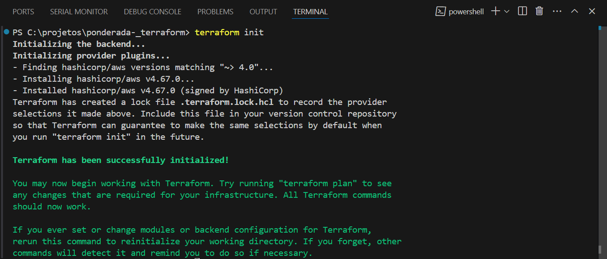
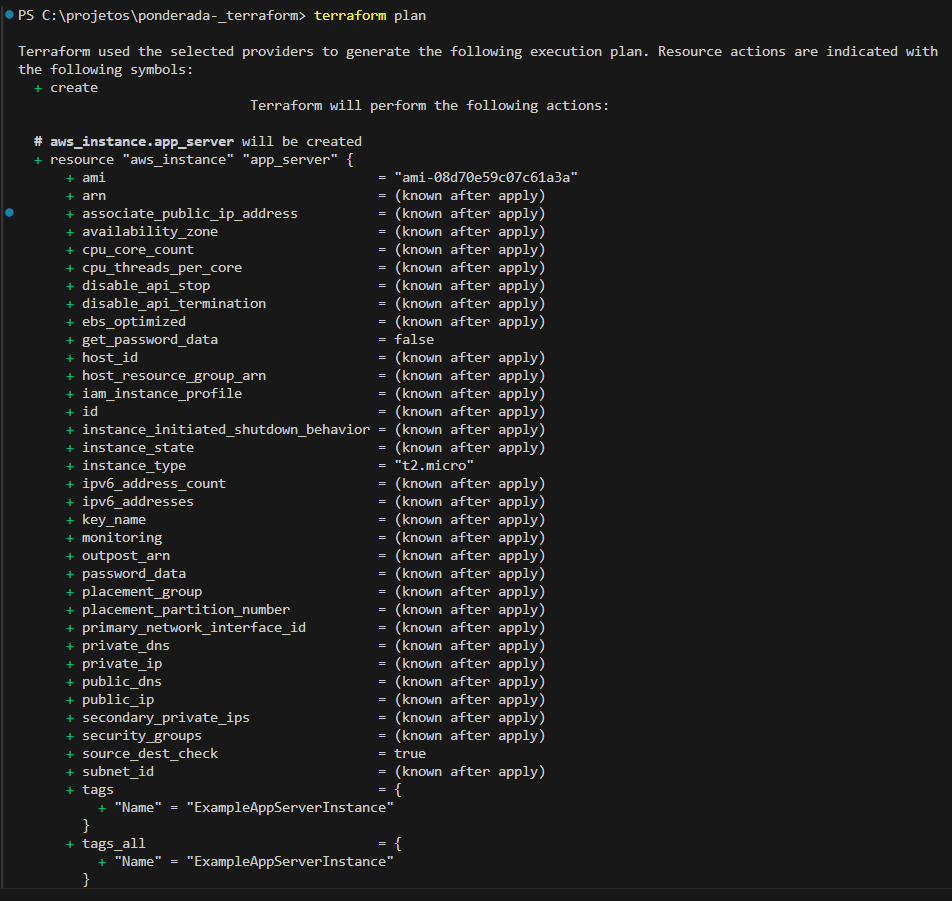
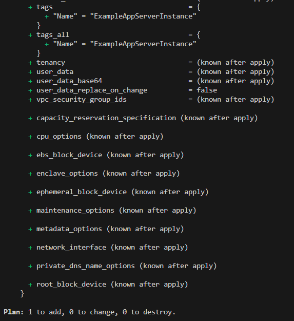
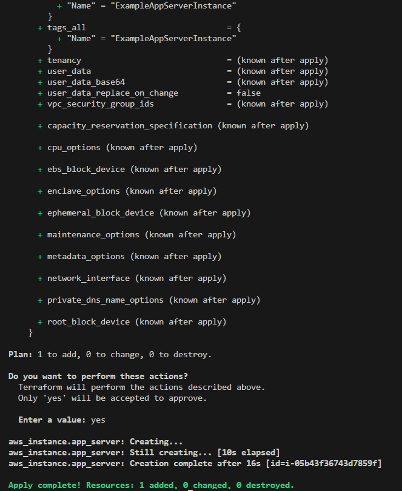
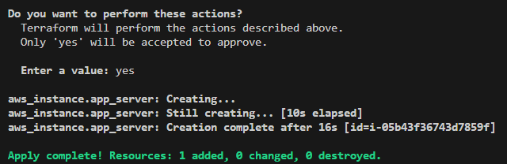
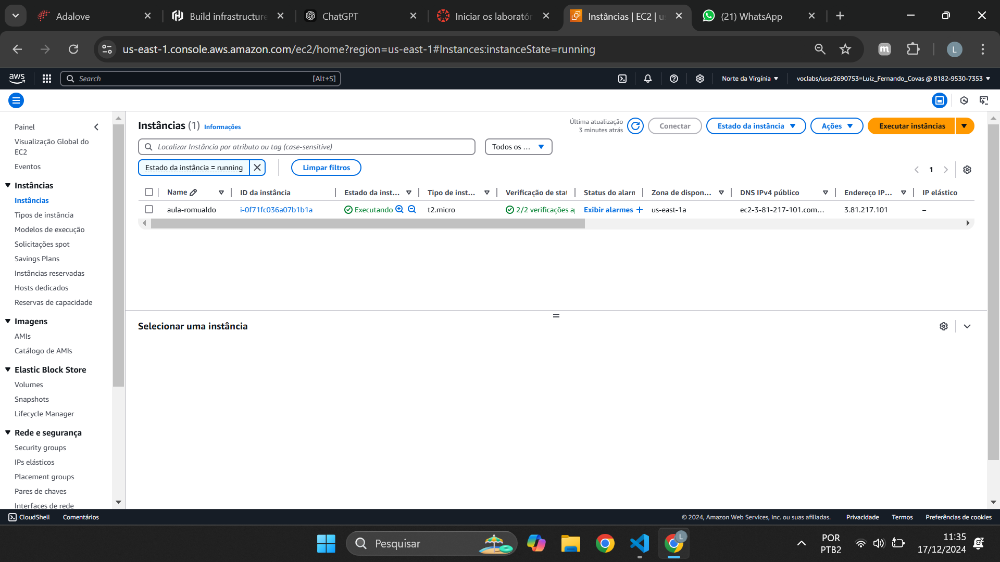
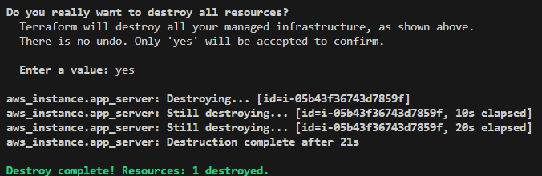

# Ponderada Terraform

Este guia descreve o que foi feito para criar uma instância EC2 na AWS usando o Terraform, seguindo exatamente o tutorial [Build infrastructure (AWS)](https://developer.hashicorp.com/terraform/tutorials/aws-get-started/aws-build).

---

## 1. Pré-Requisitos

- **Conta AWS** (com permissões de criação de recursos EC2)
- **AWS CLI** instalado e configurado
- **Terraform** instalado (binário no PATH)
- **Editor de texto/IDE** (ex.: VSCode)

---

## 2. Criando o Arquivo de Configuração do Terraform

1. **Criar pasta do projeto:**
   ```bash
   mkdir learn-terraform-aws
   cd learn-terraform-aws
    ```

2. **Criar arquivo main.tf com o conteúdo:**

```
terraform {
  required_providers {
    aws = {
      source  = "hashicorp/aws"
      version = "~> 4.0"
    }
  }
}

provider "aws" {
  region = "us-west-2"
}

resource "aws_instance" "app_server" {
  ami           = "ami-08d70e59c07c61a3a"
  instance_type = "t2.micro"

  tags = {
    Name = "Aula-Romualdo"
  }
}
```

## 3. Inicializando o Terraform

No terminal, dentro da pasta do projeto, execute:

```
terraform init
```

Seu terminal recebera a seguinte mensagem:



## 4. Ajustando as Credenciais AWS

Para o Terraform conseguir acessar sua conta AWS, configure as credenciais. 

### Via AWS CLI
```
aws configure set aws_access_key_id "SUAS CREDENCIAIS"
aws configure set aws_secret_access_key "SUAS CREDENCIAIS"
aws configure set aws_session_token "SUAS CREDENCIAIS"
aws configure set region "SUAS CREDENCIAIS"
```

## 5. Visualizar o Plano de Execução

Execute o seguinte comando:

```
terraform plan
```




## 6. Aplicar Configurações (Criar Recursos)

Execute o seguinte comando:

```
terraform apply
```



Perceba que ele vai solicitar a confirmação e você confirma com "yes"



## 7. Verificar a Instância

No Console AWS, abra EC2 → Instances e confirme se a instância Aula-Romualdo está running.



## 8. Destruir Recursos (Limpeza)

Por fim, execute o comando abaixo para destruir:

```
terraform destroy
```



Novamente ele ira solicitar que você confirme digitando "yes"
